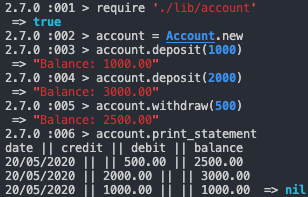

# Bank tech test

Tech test provided on Week 10 of the Makers Course. Instructions for the projects can be found [here](https://github.com/makersacademy/course/blob/master/individual_challenges/bank_tech_test.md). 
The aim of the project is to produce the best code that I can without a strict time limit.


## To run the project

### Download

```bash
  git clone git@github.com:FayeCarter/bank_tech_test.git
  cd bank_tech_test
  bundle install
```

### Run tests

```bash
  rspec
```

```bash
  rubocop
```

### Run program

Run IRB
```bash
  irb
```

Once in IRB
```bash
  require './lib/account'
  account = Account.new
```


## Requirements

- [X] You should be able to interact with your code via a REPL like IRB or the JavaScript console.  (You don't need to implement a command line interface that takes input from STDIN.)
- [X] Deposits, withdrawal.
- [X] Account statement (date, amount, balance) printing.
- [X] Data can be kept in memory (it doesn't need to be stored to a database or anything).

### Acceptance criteria

**Given** a client makes a deposit of 1000 on 10-01-2012  
**And** a deposit of 2000 on 13-01-2012  
**And** a withdrawal of 500 on 14-01-2012  
**When** she prints her bank statement  
**Then** she would see

```
date || credit || debit || balance
14/01/2012 || || 500.00 || 2500.00
13/01/2012 || 2000.00 || || 3000.00
10/01/2012 || 1000.00 || || 1000.00
```
## Process

### User Story 1
- [X] Complete
```bash
  As a customer,
  So I can save my money,
  I want to be able to deposit money into my account.
```
**Steps taken:**
- [X] Account has initial balance
- [X] Deposit adds to balance
- [X] Deposit increases transaction history
- [X] Deposit is a transaction
  - [X] transactions have date
  - [X] transactions can have credit
  - [X] transactions can have debit
  - [X] transactions can have balance

**Approach**

I created a repository and installed bundler and RSpec. I updated the Gemfile and the spec_helper to include SimpleCov to help me check my tests coverage. I also added Ruboocop so that I could ensure that my code was properly linted.

My first step was to create and Account class with an initial balance of 0. I initially accessed this by creating a method to display the balance. This was later removed as it became unnecessary.

I created a deposit method that would take a value and increase the account balance. When a deposit is made it is stored in the account transaction history.

I chose to refactor this logic into a transaction method that could handle deposits and withdrawals.


### User Story 2
- [X] Complete
```bash
  As a customer,
  So that I can access my money,
  I want to be able to withdraw money from my account
```
**Steps taken:**
- [X] Withdraw method created that reduces balance
- [X] Withdraw creates a transaction

**Approach**

As I already had created a transaction class, I updated it to include an option for credit.
If a deposit transaction was made, credit would be nil by default. 
If a withdrawal transaction was made, debit would be nil by default. 

### User Story 3
- [X] Complete
```bash
  As a customer,
  So that I can manage my account,
  I want to be able to print a statement.
```
**Steps taken:**
- [X] Create Statement class with a header
- [X] Transactions should be added to account in reverse chronological order
- [X] Statement should take transaction history

**Approach**

I chose to update deposit and withdraw methods to add transaction to the beginning of the transaction array so the the statement would receive transactions in reverse chronological order.

I initially began to implement the statement to return a string of the statement. when I tested this in irb I noticed that didn't output correctly. I refactored this logic to allow the statement to print the string onto separate lines.


### Modelling

[](https://mermaid-js.github.io/mermaid-live-editor/#/edit/eyJjb2RlIjoiY2xhc3NEaWFncmFtXG5cdEFjY291bnQgLS0-IFRyYW5zYWN0aW9uXG5cdEFjY291bnQgLS0-IFN0YXRlbWVudFxuXG5cdGNsYXNzIEFjY291bnR7XG4gICAgK2JhbGFuY2VcbiAgICArdHJhbnNhY3Rpb25faGlzdG9yeVxuICAgICtkZXBvc2l0KHZhbHVlKVxuICAgICt3aXRoZHJhdyh2YWx1ZSlcbiAgICArcHJpbnRfc3RhdGVtZW50KClcbiAgfVxuXHRjbGFzcyBUcmFuc2FjdGlvbntcblx0XHQrRGF0ZVxuICAgICtDcmVkaXRcbiAgICArRGViaXRcbiAgICArQmFsYW5jZVxuICAgIC1mbG9hdCh2YWx1ZSlcbiAgICAtY2FsY3VsYXRlKGJhbGFuY2UsIGNyZWRpdCwgZGViaXQpXG5cdH1cblx0Y2xhc3MgU3RhdGVtZW50e1xuXHRcdCtzdGF0ZW1lbnRcbiAgICArdHJhbnNhY3Rpb25zXG4gICAgK2Zvcm1hdCh0cmFuc2FjdGlvbnMpXG4gICAgK3ByaW50KClcblx0fVxuXHRcdFx0XHRcdCIsIm1lcm1haWQiOnsidGhlbWUiOiJuZXV0cmFsIn0sInVwZGF0ZUVkaXRvciI6ZmFsc2V9)